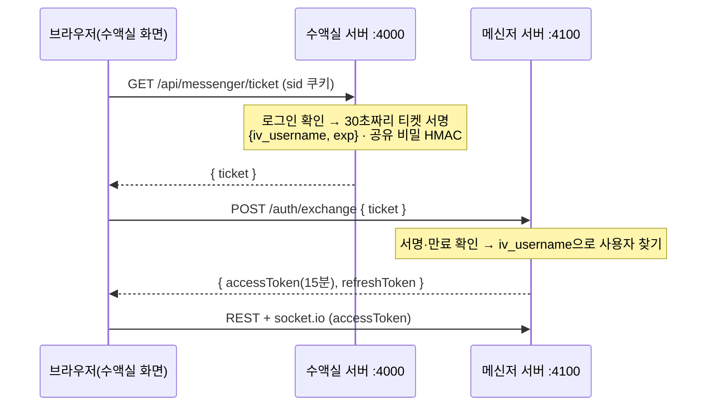

# 수액실 × 사내메신저 연동 설계

작성 2026-08-15 · 상태: 초안(합의 전) · 대상 저장소 둘 — `infusion-room`, `messenger`

---

## 0. 한 줄 요약

메신저를 수액실 안으로 **옮기지 않는다.** 메신저 서버 위에 **세 번째 클라이언트**를 만든다 —
데스크톱 앱, 태블릿 PWA, 그리고 수액실 안의 좁은 패널. 데이터는 메신저 Postgres 하나뿐이다.

## 1. 왜 이 방향인가

수액실은 수액실에서 하루 종일 켜 놓고 쓰는 화면이다. 메시지 하나 보자고 창을 바꾸는 것은
현장에서 안 하게 된다 — 그러면 메신저는 "가끔 열어보는 곳"이 되고, 급한 말은 결국 구두로 흐른다.
그래서 **읽고 답하는 데 필요한 최소한**은 수액실 화면 안에 있어야 한다.

동시에, 두 앱을 한 프로그램으로 합치는 것은 불가능하고 그럴 이유도 없다.

| | 수액실 | 사내메신저 |
| --- | --- | --- |
| 서버 | Express 5, 단일 프로세스 | Fastify 5 + socket.io |
| DB | SQLite 파일 하나 | PostgreSQL (도커) |
| 인증 | `sid` 쿠키 → `auth_tokens` | JWT 15분 + 리프레시 30일 |
| 코드 | 순수 JS | TypeScript 모노레포 |
| 배포 | NSSM 윈도우 서비스 `:4000` | Docker Compose + Caddy `:4100` |

메신저의 `DEPLOY.md`가 이미 *"같은 윈도우 PC, 4000/4100, 서로 독립"* 으로 정해 두었다.
이 문서는 그 독립을 지키면서 **화면에서만 하나로 보이게** 하는 방법이다.

## 2. 붙일 수 있다는 근거 (읽어서 확인한 것)

서버를 고치지 않아도 브라우저에서 바로 붙는다.

- `packages/server/src/app.ts:27` — `cors: { origin: true, credentials: true }`
  → `:4000`에서 뜬 화면이 `:4100` REST를 부르는 데 막힘이 없다.
- `packages/server/src/realtime/gateway.ts:76` — socket.io도 같은 CORS.
- `gateway.ts:85` — 소켓 인증은 `handshake.auth.token`(액세스 토큰) 한 줄.
  쿠키가 아니라 토큰이라 **다른 오리진에서 붙기 쉽다.**

이미 있는 것 중 패널이 쓸 것:

- `GET /channels`, `GET /channels/:id/messages`, `POST /channels/:id/messages`, `POST /channels/:id/read`
- 소켓 이벤트 `message:new`, `message:updated`, `channel:updated`, `channel:read`, `presence:update`

즉 **부족한 것은 로그인 교환 하나뿐이다.**

## 3. 가장 먼저 정해야 할 제약 — 벽걸이 모니터

수액실 상황판은 **공용 화면**이다. 하루 종일 켜져 있고, 환자와 보호자가 지나가며 본다.
거기에 개인 대화가 뜨면 안 된다. 이것이 이 연동에서 가장 큰 위험이고, 기능보다 먼저 정해야 한다.

**기기 역할을 나눈다.** 같은 앱이지만 기기마다 성격을 하나 갖는다.

| 역할 | 어디 | 메신저 패널 |
| --- | --- | --- |
| `board` | 벽걸이 모니터 | **안 뜬다.** (또는 공지 채널의 최신 한 줄만) |
| `personal` | 아이패드, 데스크 PC | 전부 뜬다 |

- 저장 위치는 테마(`iv-theme`)와 같은 방식 — 기기마다 한 번 정하고 기억한다.
- 기본값은 **`board`** 다. 정하지 않은 기기에서 개인 대화가 새어 나가는 쪽보다,
  안 보이는 쪽이 안전하다.
- 역할 변경은 마스터만.

## 4. 두 번째 제약 — 메신저가 죽어도 상황판은 산다

수액실은 진료 도구다. 메신저 컨테이너가 안 떴거나 도커가 재부팅 중이어도
상황판은 아무 일 없어야 한다.

- 패널은 **실패하면 조용히 접힌다.** 빨간 에러도, 모달도, 재시도 폭주도 없다.
- 메신저 호출은 수액실 서버를 **거치지 않는다**(브라우저 → `:4100` 직접).
  수액실 서버가 메신저를 기다리다 느려지는 일이 원천적으로 없다.
- 딱 하나 예외가 3단계의 '사건 흘려보내기'인데, 그것은 **실패해도 무시하는 단방향 호출**이다.
  타임아웃 2초, 재시도 없음, 실패는 로그만.

## 5. 로그인 넘겨주기 (SSO)

수액실에 이미 로그인했으면 메신저도 그냥 열려야 한다. 메신저가 JWT를 쓰고 있어서 깔끔하다.

정할 것:

- **공유 비밀** — 두 앱이 나눠 갖는 값 하나. 환경변수(`MESSENGER_LINK_SECRET`).
  서버 PC 한 대 안이라 이 방식으로 충분하다.
- **티켓 수명 30초** — 주소창에 남거나 새어도 곧 죽는다.
- **토큰 보관은 메모리** — 공용 PC라 `localStorage`에 두지 않는다.
  새로고침하면 티켓을 다시 받는다(수액실 로그인이 살아 있으니 사용자는 아무것도 안 한다).
- **짝이 없는 계정**은 그냥 패널이 안 뜬다. 에러가 아니라 '없음'이다.

## 6. 계정 짝짓기

수액실 계정과 메신저 계정은 별개다. 어딘가에서 이어야 한다.

**메신저 쪽에 두는 것을 권한다** — 메신저가 사람의 최종 명부이고, 수액실은 그 명부를 참조할 뿐이다.
메신저 `User`에 `ivUsername` 열 하나(고유, 비워둘 수 있음). 관리 화면에서 짝을 고른다.

수액실에 두면 계정을 늘릴 때마다 두 곳을 고쳐야 하고, 수액실 DB가 사람 명부의 사본을 갖게 된다.

## 7. 기능 경계 — 무엇을 패널에 넣나

넣는 것(수액실 안에서 끝나야 하는 일):

- 채널 목록 + 안 읽은 수
- 대화 읽기(최근 N개, 위로 스크롤하면 더)
- 답장 보내기(글자만)
- 멘션 알림 · 헤더 배지
- '메신저 열기' 버튼 하나

안 넣는 것(본체로 보낸다):

- 파일·이미지 첨부와 뷰어, 검색, 이모지 피커, 채널 만들기·초대·관리, 조직도

이유: 저 기능들은 이미 잘 만들어져 있고, 좁은 패널에 욱여넣으면 양쪽 다 나빠진다.
패널은 **"확인하고 한마디 하고 돌아가는" 자리**로 못 박는다.

## 8. 반대 방향 — 수액실 사건을 메신저로

수액실은 지금 알림 수단이 없다. 화면을 보고 있어야만 안다. 메신저가 붙으면 이게 풀린다.

보낼 만한 것(초안):

| 사건 | 어디로 | 왜 |
| --- | --- | --- |
| 곧 완료(30분 전) | 수액실 채널 | 지금은 화면을 봐야만 안다 |
| 환자 미도착 경고 | 수액실 채널 | 놓치면 베드가 빈 채로 잡혀 있다 |
| 등록 취소 되살림 | 마스터 채널 | 되돌린 기록이 남아야 한다 |
| 기록지 미작성(마감 시각) | 수액실 채널 | 하루 끝에 몰아서 찾는 일이 없어진다 |

방식: 수액실 서버 → 메신저 REST에 봇 토큰으로 글 남기기. **실패해도 무시**(4항 참조).

## 9. 수액실 기존 채팅·쪽지는 접는다

일원화가 합의됐으므로, 붙이고 나면 수액실 채팅(`ChatPanel` 358줄, `chat.js`·`messages.js`)은 은퇴한다.
다만 **한 번에 지우지 않는다.**

1. 패널이 뜨고 안정된 뒤, 기존 채팅에 "이제 메신저에서 이야기합니다" 안내를 띄운다(읽기 전용).
2. 2~4주 뒤 탭에서 감춘다. 데이터·라우트는 남긴다.
3. 지난 대화를 옮길지 정한다. 옮기지 않는 쪽을 권한다 — 짧은 업무 대화라 보존 가치가 낮고,
   옮기면 작성자·시각이 어긋난 기록이 메신저에 섞인다.

## 10. 양쪽이 할 일

**메신저 (다른 세션)**

- `POST /auth/exchange` — 티켓 → JWT
- `User.ivUsername` 열 + 관리 화면의 짝짓기
- (3단계) 봇 토큰으로 글 남기는 경로
- 환경변수 `MESSENGER_LINK_SECRET`

**수액실 (이 세션)**

- `GET /api/messenger/ticket` — 로그인 확인 후 티켓 서명
- 메신저 패널 컴포넌트(채널 목록·타임라인·입력·배지) + 소켓 연결
- 기기 역할(`board` / `personal`) 설정과 저장
- 헤더 배지, '메신저 열기' 버튼
- (3단계) 사건 발신

**둘이 합의해야 움직이는 것**: 티켓 형식(필드·서명), 공유 비밀 이름, 봇 토큰 형식.
이 세 가지가 계약이다. 이것만 고정되면 양쪽은 서로를 기다리지 않고 각자 만들 수 있다.

## 11. 순서

| 단계 | 내용 | 끝났다는 기준 |
| --- | --- | --- |
| 0 | 이 문서 합의, 계약 세 가지 고정 | 양쪽 세션이 같은 형식을 본다 |
| 1 | SSO — 티켓 발급 + 교환 | 수액실에서 '메신저 열기'를 누르면 로그인 없이 열린다 |
| 2 | 배지 — 안 읽은 수 | 헤더에 숫자가 뜨고, 읽으면 사라진다 |
| 3 | 패널 — 읽기·답장 | 수액실을 안 떠나고 대화가 된다 |
| 4 | 사건 발신 | 곧 완료가 메신저 알림으로 온다 |
| 5 | 기존 채팅 은퇴 | 탭에서 사라진다 |

1·2단계는 작다. 3단계가 이 일의 대부분이다.

## 12. 아직 안 정한 것

- 벽 모니터에서 **공지 채널 한 줄**은 보여줄 것인가, 아예 안 보일 것인가
- 패널의 자리 — 탭 하나인가, 오른쪽에 접었다 펴는 서랍인가
- 알림 소리 — 수액실은 조용해야 하는 공간인가
- 메신저가 안 떠 있을 때 '메신저 열기' 버튼도 감출 것인가
